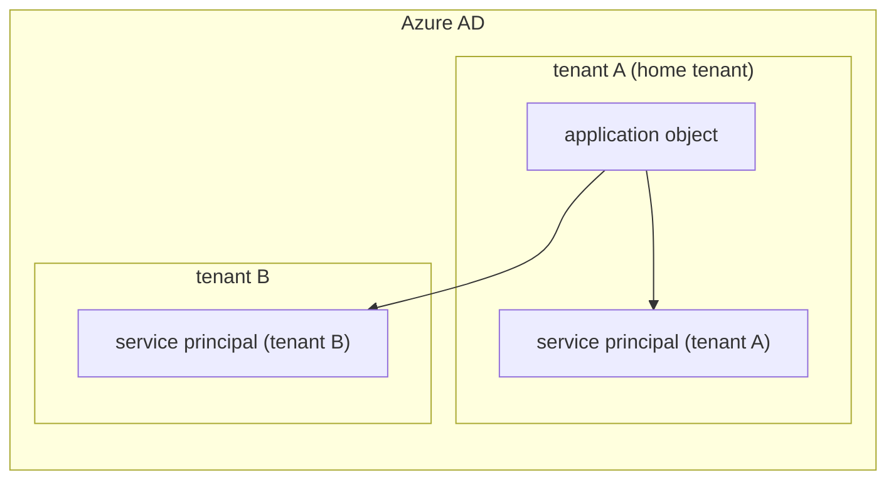
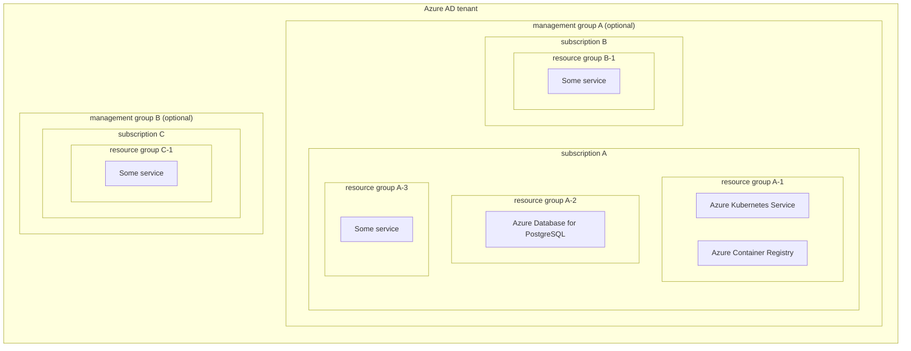

Azure では (に限らないとは思うが) 認証に関わる似たような概念が大量に出てきて混乱する。
ドキュメントを読みかえしたり OAuth 2.0/OIDC の仕様を読んだり、認証ライブラリの実装を読んだりして、やっと掴めてきた気がしたのでまとめておく。

# アカウントの種類
Azure への認証に使うアカウントには大きく以下の 2 種類存在する。

* ユーザ
* サービスプリンシパル

ユーザは名前のとおり人間によるアクセスのためのアカウントで、サービスプリンシパルはそれ以外からのアクセスのためのアカウントである。

## サービスプリンシパルとアプリケーションオブジェクト
サービスプリンシパルは単独で存在できず、認証/認可に関わる設定値を持つ雛形から作成される。
アプリケーションオブジェクトはそのようなサービスプリンシパルの雛形のうちの 1 つである。
認証/認可したいクライアントを Azure AD 上ではアプリケーションと呼び、その認証/認可に関わる設定値の雛形がアプリケーションオブジェクトであり、その雛形から実際に認証/認可できるアカウントとしてサービスプリンシパルが作成されるという関連だ。

Azure AD はテナントという単位で各アカウントなどを管理しており、一つの Azure AD で複数のテナントを持つ (マルチテナント) ことができる。
アプリケーションオブジェクトは各アプリケーション (認証/認可したいクライアント) に対して Azure AD 内でホームテナントと呼ばれる 1 つのテナントにのみ作成され、サービスプリンシパルはそのアプリケーションを利用したいテナント毎に作成される。
このような構造になっていることにより、あるアプリケーションを複数テナントで利用したい場合に、認証/認可に関わる設定値を何度も指定せずにすむ。



なお Azure Portal 上では直接名称が出てこないためややこしいが、サービスプリンシパルはエンタープライスアプリケーション内の一覧表示で、アプリケーションオブジェクトはアプリの登録で一覧表示で確認する。
cf. https://jpazureid.github.io/blog/azure-active-directory/enterprise-applications-app-registrations/#%E8%A9%B3%E7%B4%B0%E6%83%85%E5%A0%B1

また、Azure Portal のアプリの登録画面からアプリケーションオブジェクトを作成した場合、自動的にサービスプリンシパルも作成されるが、API からアプリケーションオブジェクトを作成した場合には自動的には作成されない点も terraform-provider-azuread などから作成する場合は注意が必要である。
cf. https://learn.microsoft.com/ja-jp/azure/active-directory/develop/app-objects-and-service-principals#service-principal-object

terraform resource 名は以下の通り。

* アプリケーションオブジェクト: [`azuread_application`](https://registry.terraform.io/providers/hashicorp/azuread/latest/docs/resources/application)
* サービスプリンシパル: [`azuread_service_principal`](https://registry.terraform.io/providers/hashicorp/azuread/latest/docs/resources/service_principal)

## サービスプリンシパルとマネージド ID
サービスプリンシパルを作成する雛形にはもう 1 種類存在して、マネージド ID と呼ばれる。
アプリケーションオブジェクトで自前で作成したサービスプリンシパルの場合、その認証のためのシークレットや証明書などは自身で管理しなければならない。
マネージド ID の場合はシークレットや証明書の管理が不要でユーザはアクセスさえ出来ない。
マネージド ID に対応した Azure サービス間のアクセスであればマネージド ID を利用することで、鍵管理のコストとリスクを軽減できる。

マネージド ID にも大きく以下の 2 種類存在する。

* システム割り当てのマネージド ID
* ユーザ割り当てのマネージド ID

システム割り当てのマネージド ID は Azure 上のリソース作成/削除時に自動で作成/削除されるマネージド ID で、ユーザ割り当てのマネージド ID は独立した Azure リソースとしてユーザが事前に作成するものである。
複数の Azure リソースで同一のマネージド ID を利用したい場合や、Azure リソースのライフサイクルと独立して管理したい場合にはユーザ割り当てのマネージド ID を利用する。

terraform resource 名は以下の通り。

* ユーザ割り当てのマネージド ID: [`azurerm_user_assigned_identity`](https://registry.terraform.io/providers/hashicorp/azurerm/latest/docs/resources/user_assigned_identity)

# Azure リソースへのアクセス許可
Azure AD 上のアカウントに対して、Azure リソースへのアクセス権限を与えるためには Azure RBAC を利用する。

RBAC (Role Based Access Control) の名の通り、予め Azure リソースに対して実行できること (and/or できないこと) のセットをロールという形で定義しておき、これを誰に、どのリソースに、どのロールをアサインするかを記述することで権限を与える。

## Azure リソース管理の階層構造
Azure との 1 契約を示す単位をサブスクリプションと呼び、課金単位ごとに Azure AD テナント内に複数存在する。
大規模なテナントなどではサブスクリプションも大量に存在する場合もあり、サブスクリプションをグループ化して管理する管理グループを作成することも出来る。

Azure リソースはこのサブスクリプションの下に作成されるのだが、直下に作成されるのではなく、間に関連のある Azure リソースをグループ化するリソースグループが挟まれる。



Azure リソースへのアクセス権限はこれらの階層をスコープとして与えられる。
例えば `subscription B` への権限を与えると、その配下の `resource group B-1`、`Some Service` への権限も同時に与えたことになる。

## ロール割り当て
実際に Azure RBAC を使ってロールをアサインするにはいくつか方法がある。
Azure Portal の場合は、対象とするリソースにアクセスするとメニューバーに表示されている `アクセス制御 (IAM)` 内の `ロールの割り当て` タブから実行できる。
terraform で行なう場合は [`azurerm_role_assignment`](https://registry.terraform.io/providers/hashicorp/azurerm/latest/docs/resources/role_assignment) リソースを使う。

どちらから行なう場合でも以下を明らかにする必要がある。

* 権限を与えたいアカウント
* 対象とするスコープ
* 与えるロール

Azure RBAC で権限を与えることのできる対象にはユーザ、グループ、サービスプリンシパル、マネージド ID が存在して、この文脈ではまとめてセキュリティプリンシパルと呼ぶ。
スコープは先に述べた通り管理グループ、サブスクリプション、リソースグループ、各 Azure リソースが指定できる。
組み込みで定義されているロールの一覧は [Azure built-in roles](https://learn.microsoft.com/en-us/azure/role-based-access-control/built-in-roles) を参照する。

これらを明らかにしたらロールを割り当てたいところだが、この操作を行っているアカウント自体の権限についても確認しておく必要がある。

Azure Portal の場合はログインしているユーザ、terraform なら azurerm provider に当てたユーザが以下の実行権限を持っていなければならない。

* `Microsoft.Authorization/roleAssignments/write`
* `Microsoft.Authorization/roleAssignments/delete`

この権限は組み込みロールでは [`Owner`](https://learn.microsoft.com/en-us/azure/role-based-access-control/built-in-roles#owner) または [`User Access Administrator`](https://learn.microsoft.com/en-us/azure/role-based-access-control/built-in-roles#user-access-administrator) にしか与えられていないため、どちらかのロールを作業を実行するユーザに与えておかなければならない。
// 鶏卵であるが...

# Go アプリケーションから Azure への認証
Go で Azure リソースを操作するライブラリには大きく 3 系統ある。

* 新 SDK: [`Azure/azure-sdk-for-go`](https://github.com/Azure/azure-sdk-for-go)
* API クライアント: [`Azure/azure-sdk-for-go/profiles/latest`](https://pkg.go.dev/github.com/Azure/azure-sdk-for-go@v67.3.0+incompatible/profiles/latest)
* 旧 SDK: [`Azure/azure-storage-file-go`](https://github.com/Azure/azure-storage-file-go) や [`Azure/azure-service-bus-go`](https://github.com/Azure/azure-service-bus-go) など

基本的には新 SDK が更新されており、旧 SDK は順次 (?) アーカイブされていっている。
また、それらが使う認証ライブラリについても以下の 3 つの選択肢がある。

* azidentity: [`Azure/azure-sdk-for-go/sdk/azidentity`](https://pkg.go.dev/github.com/Azure/azure-sdk-for-go/sdk/azidentity)
* MSAL: [`AzureAD/microsoft-authentication-library-for-go`](https://pkg.go.dev/github.com/AzureAD/microsoft-authentication-library-for-go)
* ADAL: [`Azure/go-autorest/adal`](https://pkg.go.dev/github.com/Azure/go-autorest/autorest/adal)

`azidentity` package は MSAL のラッパーとして実装されており、新 SDK から利用されるための package である。
ADAL は 2023/03/31 でサポートが切れるため積極的に MSAL もしくは `azidentity` package へ移行していく必要がある。
// なお日本語ドキュメントでは [2022/06/30 にサポートが切れたことになっていて](https://learn.microsoft.com/ja-jp/azure/active-directory/develop/msal-migration)、その英語版では [2023/06/30 でサポートが切れる](https://learn.microsoft.com/ja-jp/azure/active-directory/develop/msal-migration) と記述されている。

* 新 SDK は `azidentity` package が認証ライブラリとして使われる想定で実装されている
* API クライアントは ADAL が認証ライブラリとして利用されている
* 旧 SDK はサービスごとの固有の認証方法 (共有のアクセスキーなど) で実装されている
  * `Azure/azure-service-bus-go` などは OAuth 2.0 アクセストークンを受けるための口が個別に用意されている

API クライアントについては [`Azure/go-autorest`](https://github.com/Azure/go-autorest) によるコード生成で作成されており、この package もまた 2023/03/31 でサポートが切れる。
一応新 SDK と同じリポジトリに実装されているのでもしかしたら MSAL ベースの自動生成に今後切り替わるのかもしれないが、今から選択するのであれば新 SDK がよいと思われる。

## アプリケーションの認証
`azidentity` package を使うことで、Go アプリケーションから Azure に対してサービスプリンシパルとして認証出来るのだが、その詳細に踏み込む前に Azure AD が提供する認証方法について説明しておく。

MSAL と ADAL では認証/認可のために利用しているエンドポイントが別である。
MSAL は Microsoft ID プラットフォームエンドポイント (v2.0) を利用し、ADAL では Azure AD エンドポイント (v1.0) が利用される。

Microsoft ID プラットフォームエンドポイントと Azure AD エンドポイントは双方 OAuth 2.0 と OIDC に対応している。
ここでは認証/認可の機能として OAuth 2.0 と OIDC に対応しているという点さえ分かれば十分なので、詳細な差異については踏み込まない。
cf. https://learn.microsoft.com/ja-jp/azure/active-directory/azuread-dev/azure-ad-endpoint-comparison

今回のケースではエンドユーザ (人間のユーザアカウント) として Go アプリケーションを介して認証する必要はないので、OIDC で認証を行う必要はない。
OAuth 2.0 は認可のプロトコルではあるが、認可を与えるクライアントの正しさを検証するためにクライアント認証の仕様が存在する。
// この認証はいわゆる OAuth "認証" のような無理矢理実装されたものではなく正しく認証である

クライアントが認証されると、認証サーバ (ここでは Azure AD) から Azure リソースへのアクセストークンが発行され、このトークンを使って Azure リソースへアクセスする、というのがここで実装したい内容である。
OAuth 2.0 の言葉で書くと [クライアントクレデンシャルグラント](http://openid-foundation-japan.github.io/rfc6749.ja.html#grant-client) である。

あとは OAuth 2.0 でのクライアント認証としてどのような方法が使えるかが分かればよい。

## `azidentity` package で利用可能なクライアント認証
[`azidentity` v1.2.0](https://pkg.go.dev/github.com/Azure/azure-sdk-for-go/sdk/azidentity@v1.2.0) では以下の方法が利用できる。
// エンドユーザとして認証する場合などのための実装もあるが、ここでは割愛する
// cf. https://pkg.go.dev/github.com/Azure/azure-sdk-for-go/sdk/azidentity@v1.2.0#readme-credential-types

* クライアント証明書: [`ClientCertificateCredential`](https://pkg.go.dev/github.com/Azure/azure-sdk-for-go/sdk/azidentity#ClientCertificateCredential)
* クライアントシークレット: [`ClientSecretCredential`](https://pkg.go.dev/github.com/Azure/azure-sdk-for-go/sdk/azidentity#ClientSecretCredential)
* クライアントアサーション: [`ClientAssertionCredential`](https://pkg.go.dev/github.com/Azure/azure-sdk-for-go/sdk/azidentity#ClientAssertionCredential)

これらはアプリケーションオブジェクト詳細画面のメニューバーにある `証明書とシークレット` 内の、`証明書`、`クライアントシークレット`、`フェデレーション資格情報` で作成するものに対応している。

## クライアントアサーション
[RFC 7523 Section 2.2](https://www.rfc-editor.org/rfc/rfc7523#section-2.2) で JWT によるクライアント認証について定義されている。
このときの JWT をクライアントアサーションと呼ぶ。

サービスプリンシパルの `フェデレーション資格情報` を作成しようとするといくつかサービス固有のテンプレートが選択できるが、ここで設定する値はクライアントから送信される JWT で検証すべきフィールドの値である。
`その他の発行者` を選択すると分かりやすいが、以下のフィールドの値を事前に登録しておく。

* `iss`
* `sub`
* `aud`

フェデレーション資格情報で指定できる JWT は OIDC で発行された `alg` が `RS256` であるような ID トークンでなければならない。
// OIDC で払い出されてなければならないと明記されている箇所は見付けられなかったが、JWK やその場所を指定するフィールドもないので `/.well-known/openid-configuration` エンドポイントを利用した OpenID Connect Discovery 仕様で JWK を取得していると解釈した。

つまり何らかの OIDC Issuer が認証したいアプリケーションに対して OIDC で ID トークンを払い出してくれさえすれば、その ID トークンを利用して Azure AD 上のサービスプリンシパルとして認証できるということだ。
この実例については後ほど紹介する。

## 認証情報の受け渡し方
クライアントの認証方法を 3 種類から選択できることを紹介したが、この認証情報の伝え方についても 3 種類存在する。

* 環境変数: [`EnvironmentCredential`](https://pkg.go.dev/github.com/Azure/azure-sdk-for-go/sdk/azidentity#EnvironmentCredential)
  * `AZURE_TENANT_ID`: Azure AD テナント ID
  * `AZURE_CLIENT_ID`: サービスプリンシパルのクライアント ID
  * `AZURE_CLIENT_SECRET`: クライアントシークレット (`ClientSecretCredential` を使いたい場合)
  * `AZURE_CLIENT_CERTIFICATE_PATH`: クライアント証明書を配置しているパス (`ClientCertificateCredential` を使いたい場合)
  * `AZURE_CLIENT_CERTIFICATE_PASSWORD`: クライアント証明書のパスワード (`ClientCertificateCredential` を使いたいかつ証明書にパスワードが設定されている場合)
* マネージド ID: [`ManagedIdentityCredential`](https://pkg.go.dev/github.com/Azure/azure-sdk-for-go/sdk/azidentity#ManagedIdentityCredential)
* Azure CLI: [`AzureCLICredential`](https://pkg.go.dev/github.com/Azure/azure-sdk-for-go/sdk/azidentity#AzureCLICredential)
  * `az account get-access-token` コマンドで取得

さらにこれらをよしなに選択してくれる [`DefaultAzureCredential`](https://pkg.go.dev/github.com/Azure/azure-sdk-for-go/sdk/azidentity#DefaultAzureCredential) が用意されている。
ローカル環境などでは Azure CLI もしくは環境変数で、本番環境ではマネージド ID を利用して認証をする、といったケースを同じコードで使い分けられるので特段理由がなければ `DefaultAzureCredential` を利用するとよい。
`DefaultAzureCredential` の参照順序に不都合があり、自分で順序を選択したい場合には [`ChainedTokenCredential`](https://pkg.go.dev/github.com/Azure/azure-sdk-for-go/sdk/azidentity#ChainedTokenCredential) を利用して自前で実装できる。

これまで紹介した `*Credential` 型は全て `azcore.TokenCredential` interface を実装しており、新 SDK の各クライアント実装はこの interface 型を引数に要求するように実装されている。
例えば https://pkg.go.dev/github.com/Azure/azure-sdk-for-go/sdk/keyvault/azsecrets#NewClient

## `azidentity` を利用した認証実装例
ここまでの話をまとめて実装すると以下のようになる。

```go
package main

import (
	"github.com/Azure/azure-sdk-for-go/sdk/azidentity"
	"github.com/Azure/azure-sdk-for-go/sdk/keyvault/azsecrets"
)

func main() {
	cred, err := azidentity.NewDefaultAzureCredential(nil)
	if err != nil {
		panic(err)
	}

	client, err := azsecrets.NewClient("azure-key-vault-url", cred, nil)
	if err != nil {
		panic(err)
	}

	/* use client */
}
```

これで例えば `AZURE_TENANT_ID`、`AZURE_CLIENT_ID`、`AZURE_CLIENT_SECRET` を環境変数に設定して動作させれば、クライアントシークレットを使った OAuth 2.0 クライアント認証により指定したサービスプリンシパルとして認証され、払い出されたアクセストークンを利用して、Azure Key Vault へのアクセスが出来るようになる。

## ADAL やアクセストークンが利用可能な旧 SDK から `azidentity` package を利用する
ADAL や旧 SDK はアーカイブされていたりもうすぐサポートが切れたりと新規には積極的に採用しないが、とはいえすでに実装されたアプリケーションがこれらを利用している場合もあるだろう。
そのようなケースでも認証部分のみ無理矢理 `azidentity` package を利用する方法を紹介しておく。

### ADAL の場合
ADAL の Go 実装は [`Azure/go-autorest/autorest/adal`](https://pkg.go.dev/github.com/Azure/go-autorest/autorest/adal#section-readme) である。
[migration guide](https://github.com/Azure/azure-sdk-for-go/blob/main/sdk/azidentity/MIGRATION.md) に記載されている通りではあるが、[`jongio/azidext`](https://pkg.go.dev/github.com/jongio/azidext/go/azidext) package で `azidentity` package のラッパーが提供されている。

```go
import (
    "github.com/Azure/azure-sdk-for-go/sdk/azidentity"
    "github.com/Azure/azure-sdk-for-go/services/resources/mgmt/2018-06-01/subscriptions"
    "github.com/jongio/azidext/go/azidext"
)

cred, err := azidentity.NewClientSecretCredential(tenantID, clientID, secret, nil)
handle(err)

client := subscriptions.NewClient()
client.Authorizer = azidext.NewTokenCredentialAdapter(cred, []string{"https://management.azure.com//.default"})
```

ここで `"https://management.azure.com//.default"` は OAuth 2.0 スコープであり、サービスエンドポイント URL + 権限という形式で表現される。
サービスエンドポイント URL の一覧や確実な調べ方は見付けることが出来なかったので、知っている人がいれば教えてほしい。

### アクセストークンが利用可能な旧 SDK の場合
具体的には [`Azure/azure-service-bus-go`](https://github.com/Azure/azure-service-bus-go) がそのような例になっている。
[`servicebus.NamespaceWithTokenPrivider()`](https://pkg.go.dev/github.com/Azure/azure-service-bus-go#NamespaceWithTokenProvider) が要求する [`auth.TokenProvider`](https://pkg.go.dev/github.com/Azure/azure-amqp-common-go/v3/auth#TokenProvider) interface が提供できればよいので、以下のような `tokenProvider` 型を用意してラップしてやればよい。

```go
package main

import (
	"context"
	"strconv"

	"github.com/Azure/azure-amqp-common-go/v3/auth"
	"github.com/Azure/azure-sdk-for-go/sdk/azcore/policy"
	"github.com/Azure/azure-sdk-for-go/sdk/azidentity"
	servicebus "github.com/Azure/azure-service-bus-go"
)

type tokenProvider struct {
	cred *azidentity.DefaultAzureCredential
}

func (t tokenProvider) GetToken(_audience string) (*auth.Token, error) {
	accessToken, err := t.cred.GetToken(context.Background(), policy.TokenRequestOptions{
		Scopes: []string{
			"https://servicebus.azure.net//.default",
		},
	})
	if err != nil {
		return nil, err
	}

	return auth.NewToken(
		auth.CBSTokenTypeJWT,
		accessToken.Token,
		strconv.Itoa(int(accessToken.ExpiresOn.Unix())),
	), nil
}

func main() {
	cred, err := azidentity.NewDefaultAzureCredential(nil)
	if err != nil {
		panic(err)
	}

	ns, err := servicebus.NewNamespace(
		servicebus.NamespaceWithTokenProvider(tokenProvider{cred: cred}),
	)
	if err != nil {
		panic(err)
	}

	ns.Name = "some-servicebus-namespace-name"
	ns.Suffix = "servicebus.windows.net"

	/* use service bus client */
}
```

# マネージド ID の利用
これまではサービスプリンシパルでの認証を主に紹介してきたが、マネージド ID に対応しているリソースであれば、認証情報の管理を減らすためこれを利用したい。
例えば先のアプリケーションを Azure VM 上で動作させている場合にはマネージド ID が利用できる。

以下のようにすればマネージド ID による認証が利用できる。

1. アプリケーションを動作させる Azure VM でマネージド ID を有効化する
1. ロール割り当てでマネージド ID に操作させたい Azure リソースへのアクセス権限を与える
1. `azidentity.DefaultAzureCredential` または `azidentity.ManagedIdentityCredential` 型で認証を実装したアプリケーションを Azure VM 上で動かす

Azure VM 上では IMDS (Instance Metadata Service) で VM に関する情報が HTTP で取得できる。
具体的には Azure VM 内で 169.254.169.254 にアクセスすればよい。

IMDS には Azure VM に紐付くマネージド ID を使ってアクセストークンを取得する機能もある。
cf. https://learn.microsoft.com/ja-jp/azure/active-directory/managed-identities-azure-resources/how-to-use-vm-token#get-a-token-using-http
// エンドポイント名が `/oauth2/token` となっているだけで仕様的には OAuth 2.0 の仕様は満たしていないようには見える。

その他のマネージド ID が利用できるサービスについても似たようなリクエストでアクセストークンが取得できるようになっている。

## AKS 上のコンテナとして動作する Go アプリケーションからマネージド ID を利用する
AKS 上のコンテナも結局 Azure VM 上で動いているのだからどうにかホストの IMDS に接続できたらマネージド ID が利用できる、という話ではない。
コンテナごとに利用するマネージド ID を指定してアクセストークンを払い出すことが (プレビュー機能ながら) 出来る。
cf. https://learn.microsoft.com/ja-jp/azure/aks/workload-identity-overview

プレビュー機能のため利用するためには `EnableWorkloadIdentityPreview` フィーチャーフラグを有効化しなければならない。
その後、`az aks create` コマンドであれば `--enable-oidc-issuer` と `--enable-workload-identity` オプションを有効にして AKS クラスタを作成すれば利用できるようになる。

もう 1 つ問題がある。`azidentity` の (2023/01/17 現在の) latest である v1.2.0 ではこの機能に対応していない。
ネイティブに利用するには v.1.3.0-beta.1 以降の利用が必須である。

AKS ワークロード ID を利用した認証フローは先に紹介したクライアントアサーションによる認証が利用されている。
AKS クラスタ作成時に `--enable-oidc-issuer` というオプションを付けたが、これにより、AKS クラスタが OIDC Issuer として機能するようになる。
これにより k8s の ServiceAccount リソースに対する ID トークンがこの Issuer から発行されるようになる。
この ID トークンの内容について認証したいマネージド ID のフェデレーション資格情報を設定してやれば、コンテナに対して Azure 上へのアクセストークンが払い出せる、という仕組みである。
フェデレーション資格情報の作成画面にも `Azure リソースにアクセスする Kubernetes` としてテンプレートも用意されている。

つまり、k8s の ServiceAccount と Azure のマネージド ID をマッピングする機能とも言える。
k8s 側にもマッピング対象のマネージド ID を伝えてやる必要がある。
なおコンテナ自体は Azure リソースではないのでシステム割り当てのマネージド ID は存在せず、事前にユーザ割り当てのマネージド ID を作成しておく必要がある。

* ServiceAccount リソースの `metadata.annotation` として `azure.workload.identity/client-id: ${USER_ASSIGNED_MANAGED_ID}` を指定する
* ServiceAccount リソースの `metadata.label` として `azure.workload.identity/use: "true"` を指定する
* Pod リソースの `spec.serviceAccountName` にアノテーションとラベルを付けた ServiceAccount を指定する

AKS ワークロード ID を有効化すると k8s クラスタ上に Mutating Admission Webhook がデプロイされて、テナント ID や ServiceAccount に記述したクライアント ID を Pod の環境変数に設定するなどの準備は行ってくれる。

これで v1.3.0-beta.1 以降の `azidentity` package であれば `azidentity.DefaultAzureCredential` を利用しているだけで自動的にワークロード ID 機能を介してマネージド ID を使ってアクセストークンを取得できる。
また、k8s ServiceAccount の ID トークンをクライアントアサーションとして設定し、クライアントクレデンシャルグラントを動かすだけと言えばそれだけなので、生の MSAL で実装するのも難しくはない。

先ほど v1.3.0-beta.1 ではネイティブに AKS ワークロード ID が利用できると書いたが、v1.2.0 でもネイティブでない方法であれば利用できる。

準備すべき内容は先のものに以下を加える。

* Pod リソースの `metadata.annotation` として `azure.workload.identity/inject-proxy-sidecar: "true"` を指定する

これにより Pod にサイドカーコンテナが追加される。
この状態で `azidentity.DefaultAzureCredential` を利用していると、設定されている環境変数から、マネージド ID による認証が必要と解釈して IMDS へのアクセスを試みる。
サイドカーコンテナはこの通信をプロキシして、k8s ServiceAccount トークンを使ってアクセストークンを払い出してくれる。

このようにして k8s におけるサイドカーコンテナの運用自体が面倒であるという点に目をつむれば、v1.2.0 でも AKS ワークロード ID が利用できる。

# その他の話題
## AKS クラスタでのマネージド ID 利用
AKS クラスタ自体もマネージド ID に対応している。
この権限は以下のために利用される。

* コントロールプレーンによる Azure リソースの操作
  * Service type LoadBalancer を作成したときの Azure Load Balancer の操作や Public IP address の取得など
* ワーカノードの kubelet による Azure Container Registry へのアクセス

ここで利用される権限はサービスプリンシパルを直接アサインすることも、マネージド ID を利用することも可能である。
サービスプリンシパルを利用すると、コントロールプレーンとワーカノードの権限は双方同じものが利用されるが、マネージド ID の場合は別々のものが使われる。

どちらにせよワーカノードに設定したアカウントに対して `AcrPull` ロールを与えてやれば、ACR へのアクセスに `imagePullSecret` が不要になる。

## GitHub Actions から Azure へのアクセスにクライアントアサーションによる OAuth 2.0 クライアント認証を利用する
GitHub Actions では Job に対して ID トークンを払い出す OIDC Issuer が提供されている。
cf. https://docs.github.com/ja/actions/deployment/security-hardening-your-deployments/about-security-hardening-with-openid-connect

つまりクライアントアサーションによる OAuth 2.0 クライアント認証が利用できるということだ。
こちらもフェデレーション資格情報のテンプレートに `Azure リソースをデプロイする GitHub Actions` として用意されている。

本題とはあまり関係ないが Circle CI のインシデントにより CI とクラウドサービスの連携について見直している人も多いだろうし、ここまで紹介したのと同じ仕組みで動作しているので理解しやすいかと思い追記した。
