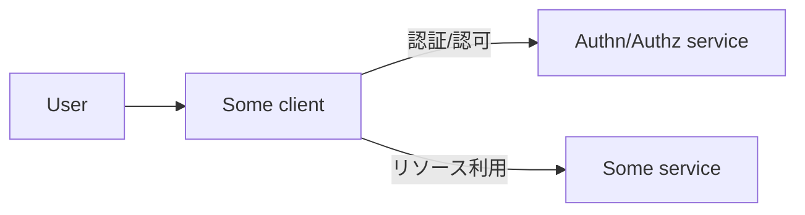

Zenn を利用したい、Gmail を利用したい、Twiiter を利用したい。
このとき最初に行うのはユーザ作成と作成したユーザでの認証である。
ユーザはブラウザやスマホの上で動くクライアントを利用して認証し、サービスを利用する。

他にも Google カレンダーと Todoist を連携させたり、TweetDeck などのクライアントを使ってツイートをしたり、サービスの一部/全部を間接的に利用したいケースもある。

また、GitHub Actions から Azure Key Vault に保存されたシークレットを参照するなどユーザに相当するものが存在しない (もしくは GitHub Actions 自体がユーザであると考えられる) ケースもある。

## クライアントに認証情報を与える
素朴にはクライアントに直接ユーザの認証情報 (ユーザ名とパスワードなど) を与えてしまう実装が考えられる。
しかし認証情報を与えるクライアントは信頼できるものだろうか?
GitHub Actions など機械的なアクセスが増えたときに、認証情報が不正利用されていることを膨大なアクセスログから区別できるだろうか?

## クライアント専用の鍵を与える
もう少しマシなのはクライアントごとに専用の鍵を与える実装である。
この実装であれば、例えば GitHub Actions からアクセスする場合は GitHub Actions 用の鍵というように用意されるため、アクセスログなども鍵ごとに管理可能になり利用状況を追跡しやすい。
また、ユーザの鍵とは別なので、鍵ごとに権限を絞ったりも出来る。

## OAuth
このクライアント専用の鍵 (アクセストークン) を自動的に払い出すためのプロトコルが OAuth であると考えられる。
OAuth のフローを読むときはアクセストークンを払い出す部分とユーザが許可を与える (認可) 部分を整理して読むとよい。

## OIDC (OpenID Connect)
クライアント専用の鍵を与える場合、クライアントは識別できる。
これはサービスの一部を間接的に利用しているケースや GitHub Actions などマシンユーザからのアクセスであれば便利である。

しかし、サービスを直接利用するケースなどユーザとして認証したい場合もある。
また、サービスが自身でユーザ情報を持ちたくないと考えている場合もある。

OAuth はアクセストークンを自動で払い出すためのプロトコルと書いた。
OAuth に対応したサービスがそのサービスの持つユーザ情報へのアクセス許可を与えられる場合どうだろうか。
OAuth で認可を与える際、もちろん第三者が勝手に与えられては困るので、ユーザに認証させてから許可を求める。

これらを組み合わせると、アクセストークンの発行を根拠に認証したことにできないだろうか、という発想で実装されているのがいわゆる OAuth "認証" である。
しかしあくまで OAuth 自体は認可プロトコルである。
ユーザ情報を提供していても各社バラバラなら都度専用に実装が必要になる。
また認可フローとしての脆弱性は OAuth というプロトコルの中で解消されていくが、それを認証フローに適用した場合、その実装部分は個別に脆弱かどうかが判断されることになる。

ユーザ情報の取得方法などが標準化された OAuth 2.0 の拡張として実装された認証プロトコルが OIDC (OpenID Connect) である。
認証完了の証としてのユーザ情報を格納した ID トークンと、OAuth のアクセストークンによりユーザ情報を取得するための仕様が追加されたものである。

## OAuth クライアント認証
さて話を OAuth に戻す。
アクセストークンを払い出すのはよいが、払い出す先のクライアントは正しいだろうか?

それを検証するために OAuth にはクライアントを認証の仕様がある。
アクセストークンを払い出すエンドポイントへの HTTP アクセスで認証情報を付与することで実現される。
Basic 認証や TLS クライアント認証などさまざまな認証方法が規定されているが、特筆すべきは JWT (JSON Web Token) 検証による認証も用意されているということである。

OIDC において、ID トークンは JWT であることが要求されている。
// 余談だが、OAuth アクセストークンについては形式についての規定はない。

これを組み合わせて、OIDC で発行した JWT を OAuth のクライアント認証に利用する、というフローが考えられる。

例えば以下の実装もそのような例のうちの一つである。
https://docs.github.com/ja/actions/deployment/security-hardening-your-deployments/about-security-hardening-with-openid-connect

Azure の場合だと、GitHub Actions の Job に GitHub OIDC Issuer が ID トークンを払い出し、その ID トークンで Azure AD に OAuth クライアント認証をかけることでアクセストークンを取得する。
事前に Azure サービスプリンシパルに必要なリソースへのロール割り当てを実行しておくことで認可を与える。
またフェデレーション資格情報に ID トークンの検証すべきフィールドを指定しておくことで ID トークンが GitHub Actions に発行されたことを検証する。

https://learn.microsoft.com/ja-jp/azure/active-directory/develop/workload-identity-federation-create-trust?pivots=identity-wif-apps-methods-azp
